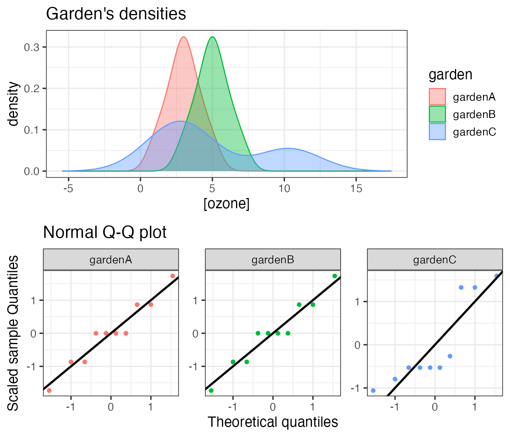
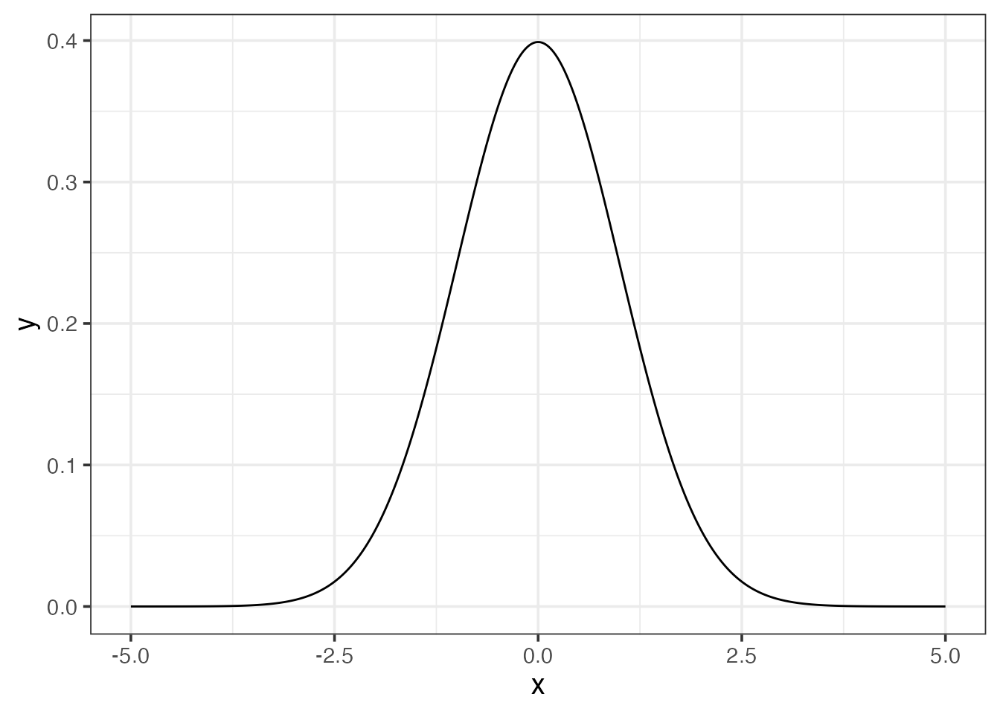

  
```{r setup, include = FALSE}
library(tidyverse)
```
  

# 1. Testing for normality

We are going to use the `garden` data, with the measurement of ozone concentrations in 3 different areas.

> Objective: the idea is to display the distribution of all three series and look at the shapes. The goal is also to learn how to plot using R and how to customize and combine plots.
Eventually, the final result should look like:


  

## 1.1 Loading the data

Import the garden dataset from `data/garden.csv`.

## 1.2 Plotting the main densities

Just plotting the 10 points for each dataset won’t help much. When looking at the density distribution, one can observe the shape,
if it is bell-shaped or not, and how they compare to each other.
You have already learned to use the `dnorm()` function which produces the density of a normal distribution with a mean of 0
and a standard deviation of 1. 

- Use this function to plot a serie of `x` values in order to obtain a smooth curve (_e.g._ 100 values from -5 to 5). 

#### Tip
`seq()` is a very neat function that you should memorize, remember to check its help page with `?seq`. The argument `length.out` should help to have a smooth line.


```{r}
# Write your answer here
```


Now, you would like to apply a density function to your own data. 

- Draw the density plot of gardenA using `ggplot2`.

#### Tip
`geom_density` provides an area while `geom_line` with the proper stat gives the same density curve without the area


```{r}
# Write your answer here
```


`ggplot2` centers the view around the range of our data. Try to enhance the output with `expand_limits()` to visualize the extrapolated curve or use the result of `density()` and plot it with `ggplot2`. See for example this output:


  
```{r}
garden <- read_csv("data/garden.csv")
density(garden$gardenA) # Base R selection of columns in data frame
```

the `x` and `y` data are quantile summarised (based on the 500 data points generated by default).
Each correspond to the `x` and `y` axis of the density plot respectively.

- get the limits of the `x` densities per garden. Before, ask yourself if the _data frame_ is **tidy**?
  
```{r}
# Write your answer here
```


- Add the two other densities (garden B and C) to the first plot, mapping the `fill` to garden's name. The `x` limits will be the minimum and maximum for all 3 gardens.
  Before adding the other gardens, be sure to use a  **tidy** _data frame_.

```{r}
# Write your answer here
```


### Conclusion

What can you say about the shapes of all the three empirical distributions?

```{r}
# Write your answer here
```


## 1.3 Plotting Quantile-Quantile comparison to the normal distribution

A Q-Q plot allows you to see how the quantiles of two distributions fit. In our case, we want to compare each of the garden’s distribution to the normal distribution. Use the function `qqnorm()` and add the ideal line with `qqline()`. When the dots are close to the plain line, then the distribution follows the normal one.

```{r}
# Write your answer here
```


Try to draw the Q-Q plot with `ggplot`. The `stat_qq()` function provided by `ggplot` might be helpful, by default it uses the normal distribution.

To enhance the way of drawing a Q-Q plot:

- **scale** the ozone concentration for each garden
- plot the scaled sample quantiles against the theoretical quantiles (`stat_qq`). 
- add the line $y=x$ (`geom_abline`).

#### Tip
the function `scale()` allows to center a distribution as z-scores:

- mean centered on 0
- standard deviation of 1


```{r}
# Write your answer here
```


## 1.4 Plotting all together

Return to your density ggplot and store it in a variable called `p1`. 
Similarly store your Q-Q plot (ggplot version) in the variable `p2`. 
To combine both plots into a single one, try to use the `plot_grid()` function provided by the `cowplot` package.

```{r}
# Write your answer here
```


## 1.6 Statistical tests to assess normality

Use the Shapiro test for the three datasets, using  $\alpha=0.05$.

* What can you conclude about these 3 distributions? 
* Are they following the normal distribution? 
* Does it fit your visual expectations?

```{r}
# Write your answer here
```


# 2 Compare two samples

We are now going to use the `wings` dataset, which you can download [here](data/wings.csv). This dataset contains the measurement of wing length in insects living in 2 different areas.

> Objective: Compare both locations and determine if the insects have different sizes of wings. By _difference_, we mean testing several components of what defines a distribution.

## 2.1 Loading the data

- Load the `wings` dataset that contains the insect wing length measured in two different locations.

```{r}
# Write your answer here
```


- What are the variables? Are they continuous or discrete?

```{r}
# Write your answer here
```


## 2.2 How many observations per location

Before doing anything, we would like to have an idea of how much data we are dealing with: globally and per location. How many observations do we have per location?

```{r}
# Write your answer here
```


## 2.3 Plotting densities

First, once we have a new dataset, it is often useful to represent it graphically to get an idea on how it looks like.

Draw two plots on the same page (one above the other):

- The two densities with their respective means as vertical dashed lines with the corresponding colors.

```{r}
# Write your answer here
```


- A boxplot of the sizes in both locations.

```{r}
# Write your answer here
```


```{r}
# Write your answer here
```


- Do the means appear different? What about the medians?

#### Tip
Adding notches to a box plot allows you to visually evaluate confidence intervals (by default 95% CI) for the medians.
Use `geom_boxplot()` and set `notch = TRUE`.
If the notches do not overlap, this is evidence that the medians are different.

```{r}
# Write your answer here
```


```{r}
# Write your answer here
```


## 2.4 Compare the two means

Before comparing the two means, we need to ensure that both distributions are normal in order to determine which test we should use. 

1. Which test should be used to test the normality? Are A and B following a normal distribution?

#### Tip
- Try to stick to the tidyverse way of doing and use `tibbles`. Think about setting a grouping variable and **nest** the tibble.
- To apply your test to a subset, define a new column using mutate and use the function `map()` from the `purrr` package to _map_ your statistical function to each subset. (You will learn more how to use the function `map()` next time)
- Finally, use the `tidy()` function from the `broom` package to get a nice output.


```{r}
# Write your answer here
```


2. To compare two means, what test should we use if 1. is true? or false?

```{r}
# Write your answer here
```


3. Test if the variances are different between the 2 locations? What is the consequence for the test chosen in 2?

```{r}
# Write your answer here
```


3. Define $H_0$ for the appropriate test, and then the alternative hypothesis $H_1$.

```{r}
# Write your answer here
```


4. Perform the test using the built-in _R_ function and conclude

#### Tip
Using the argument `data` of the t test function allows you to use non-standard evaluation of the column of interest


```{r}
# Write your answer here
```

